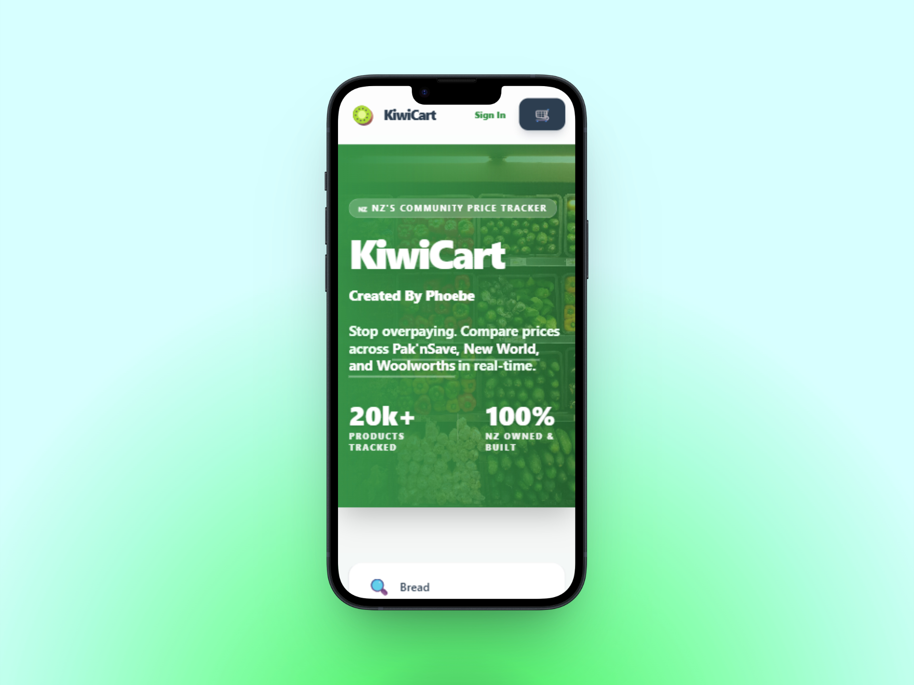

# KiwiCart - NZ Supermarket Price Sharing

🔗 **Live Demo:** [https://kiwicart.azurewebsites.net/](https://kiwicart.azurewebsites.net/)



KiwiCart is a community-driven platform designed to tackle the New Zealand Cost of Living Crisis. It empowers users to compare supermarket prices across major brands (Pak'nSave, New World, and Woolworths) using real-time data and location-based search.

## Project Mission
In a market dominated by few players, KiwiCart aims to provide price transparency. We believe every Kiwi should have access to the best prices for their daily essentials without having to visit multiple websites or stores.

## Data Integration & Compliance
KiwiCart is built on the principles of transparency and ethical data sourcing.
- **No Scraping:** This project does not employ web scraping or automated crawling technologies.
- **Direct Integration:** All price information is retrieved through standard API integrations to ensure data integrity and reliability.
- **Compliance:** We respect the terms of service of all integrated retailers and aim to support the community by providing accurate, real-time information to help manage the cost of living.

## Core Features
- **Live Data Integration:** Real-time price updates from Pak'nSave, New World, and Woolworths to ensure accurate comparison.
- **Multi-store Synchronization:** Seamlessly sync basket items across different supermarket brands to find the best total value.
- **Hybrid Caching:** Background database caching with 24-hour expiry to ensure speed while maintaining data accuracy.
- **Location-Aware Store Map:** Integrated Google Maps view to find the cheapest stores near you.
- **Favorites & Profiles:** Secure user accounts via Auth0 to save your favorite products and personalized shopping lists.
- **Accessibility First:** Fully compliant with WCAG AA standards, featuring high-contrast themes and full screen-reader support.

## Usage
1. **Search:** Enter a product name (e.g., "Milk" or "Bread") in the search bar.
2. **Compare:** View a side-by-side comparison of prices across available supermarkets.
3. **Basket:** Add multiple items to your virtual basket to calculate which store offers the best total price for your shop.
4. **Locate:** Use the map view to find the physical store location for the best deals.

## Roadmap
- [x] Real-time multi-store price comparison
- [x] Integrated Google Maps store locator
- [x] User favorites and shopping lists
- [ ] Historical price tracking and trend charts
- [ ] Gemini AI smart shopping recommendations
- [ ] Mobile-optimized PWA (Progressive Web App)

## Getting Started

### Prerequisites
- Node.js (v18+)
- PostgreSQL (Local or Docker)
- Google Maps API Key
- Auth0 Domain & Client ID

### Installation
1. **Clone the Repo:**
   ```bash
   git clone <repository-url>
   cd KiwiCart
   ```
2. **Install Dependencies:**
   ```bash
   npm install
   ```
3. **Environment Variables:**
   Create a `.env` file in the root based on `.env.example`.
4. **Setup Database:**
   ```bash
   npm run knex migrate:latest
   npm run knex seed:run
   ```
5. **Run Development Server:**
   ```bash
   npm run dev
   ```

## License
ISC

---
*Helping Kiwis save money, one basket at a time.*
